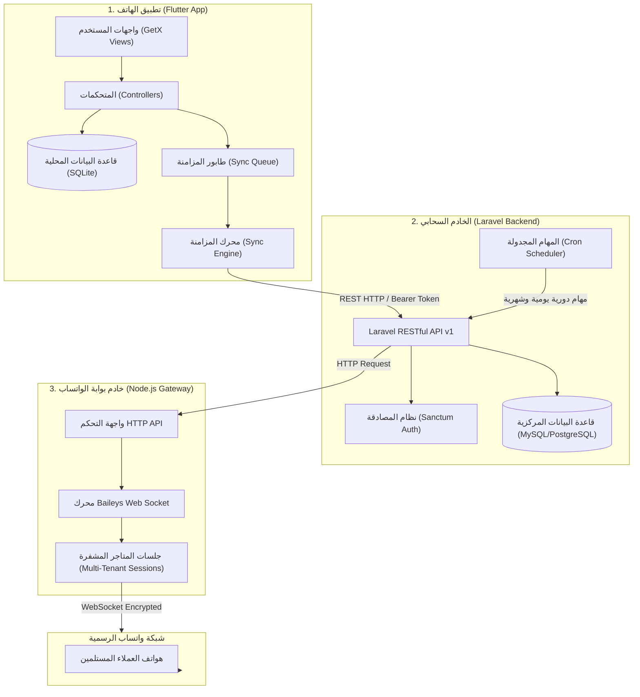
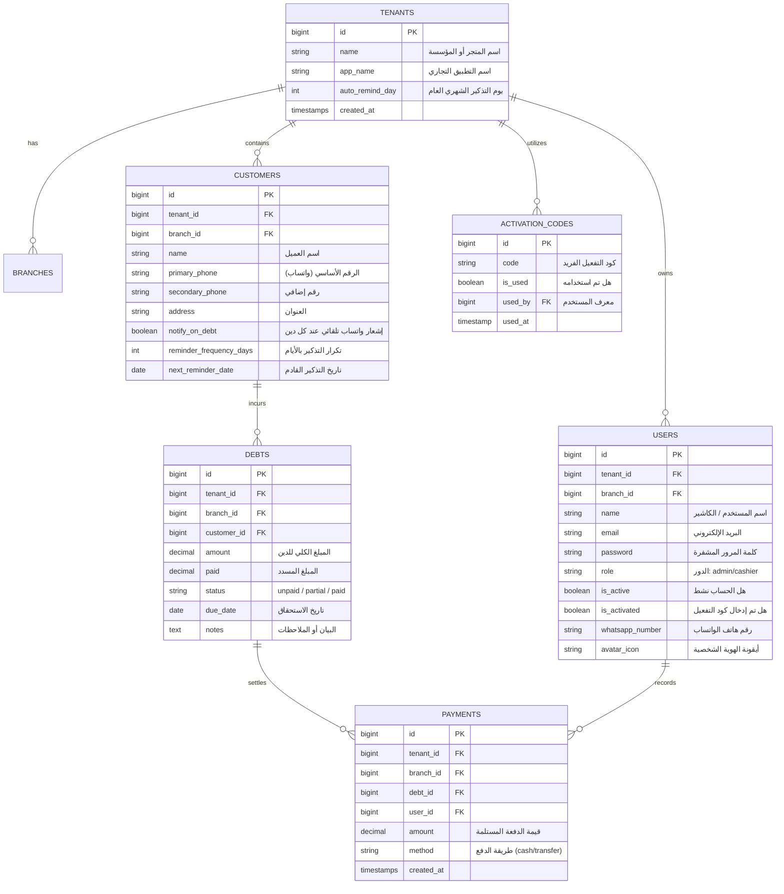
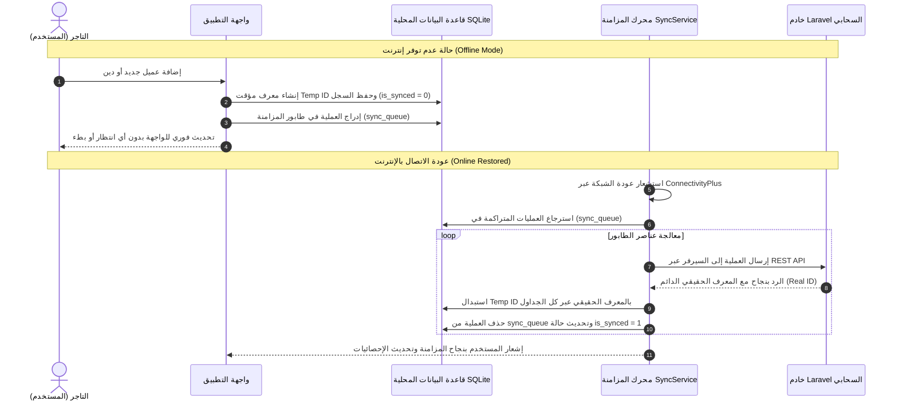
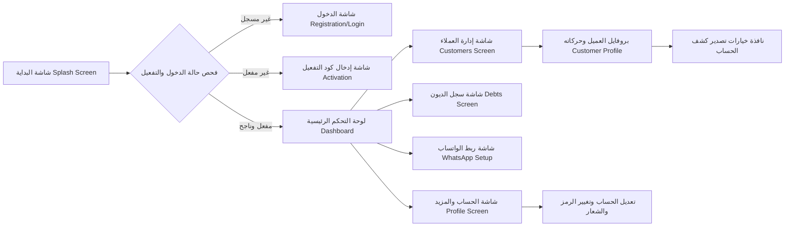

# 📋 التقرير الشامل والمفصل لنظام وتطبيق "تسوية" (Taswiyah)
> **نظام إدارة الديون، التحصيلات، وحسابات العملاء الذكي للمتاجر والشركات**
> **تاريخ التقرير:** 2026-09-20  
> **الإصدار:** 1.0.0+1  

---

## 📑 فهرس المحتويات
1. [نظرة عامة على النظام (Executive Summary)](#1-نظرة-عامة-على-النظام-executive-summary)
2. [معمارية النظام الشاملة (System Architecture)](#2-معمارية-النظام-الشاملة-system-architecture)
3. [مكونات النظام الثلاثية (Core Ecosystem)](#3-مكونات-النظام-الثلاثية-core-ecosystem)
   - [أولاً: تطبيق الهاتف الذكي (Flutter Client)](#أولاً-تطبيق-الهاتف-الذكي-flutter-client)
   - [ثانياً: الخادم الخلفي وقاعدة البيانات (Laravel Backend API)](#ثانياً-الخادم-الخلفي-وقاعدة-البيانات-laravel-backend-api)
   - [ثالثاً: بوابة الواتساب السحابية المستقلة (Node.js WhatsApp Gateway)](#ثالثاً-بوابة-الواتساب-السحابية-المستقلة-nodejs-whatsapp-gateway)
4. [هيكلية قاعدة البيانات ونماذج البيانات (Database Schema & Models)](#4-هيكلية-قاعدة-البيانات-ونماذج-البيانات-database-schema--models)
   - [قاعدة البيانات السحابية (Cloud DB)](#قاعدة-البيانات-السحابية-cloud-db)
   - [قاعدة البيانات المحلية (Local SQLite DB)](#قاعدة-البيانات-المحلية-local-sqlite-db)
5. [آلية العمل التفصيلية ودورات العمل (System Workflows)](#5-آلية-العمل-التفصيلية-ودورات-العمل-system-workflows)
   - [دورة تسجيل وتفعيل الحسابات (Auth & Licensing)](#1-دورة-تسجيل-وتفعيل-الحسابات-auth--licensing)
   - [محرك المزامنة غير المتصل (Offline-First Sync Engine)](#2-محرك-المزامنة-غير-المتصل-offline-first-sync-engine)
   - [إدارة العملاء واستيراد جهات الاتصال (Customer Management)](#3-إدارة-العملاء-واستيراد-جهات-الاتصال-customer-management)
   - [تسجيل الديون والتحصيل بنظام FIFO (Debt & Payment Engine)](#4-تسجيل-الديون-والتحصيل-بنظام-fifo-debt--payment-engine)
   - [نظام الإشعارات الآلي عبر واتساب (Automated WhatsApp Engine)](#5-نظام-الإشعارات-الآلي-عبر-واتساب-automated-whatsapp-engine)
   - [محرك استخراج التقارير وكشوفات الحساب (PDF & Excel Exports)](#6-محرك-استخراج-التقارير-وكشوفات-الحساب-pdf--excel-exports)
6. [الواجهات وتجربة المستخدم (UI/UX Screens)](#6-الواجهات-وتجربة-المستخدم-uiux-screens)
7. [الحماية، الموثوقية والمراقبة (Security & Reliability)](#7-الحماية-الموثوقية-والمراقبة-security--reliability)
8. [دليل التشغيل والنشر (Deployment & Running Guide)](#8-دليل-التشغيل-والنشر-deployment--running-guide)

---

## 1. نظرة عامة على النظام (Executive Summary)

**نظام تسوية (Taswiyah)** هو حل تقني متكامل وموجّه للأنشطة التجارية والمحلات والمتاجر والشركات لإدارة ديون العملاء ومتابعة التحصيلات المالية بدقة متناهية وسرعة فائقة.

### أبرز القيم التشغيلية للنظام:
* **العمل بدون إنترنت بالكامل (Offline-First):** إمكانية إدخال العمليات (إضافة عملاء، تسجيل ديون، تحصيل دفعات) دون اتصال، مع مزامنة لحظية وتلقائية عند عودة الشبكة.
* **الأتمتة الكاملة لإشعارات واتساب (Zero-Cost WhatsApp Automation):** إرسال إشعارات فورية للعميل عند تسجيل دين جديد، إشعار سند قبض عند السداد، ومطالبات دورية مجدولة دون الحاجة لاشتراكات باهظة في WhatsApp Business API.
* **عزل البيانات متعدد المستأجرين (Multi-Tenancy):** نظام سحابي مركزي يعزل بيانات كل تاجر/متجر بشكل آمن ومنفصل مع دعم الفروع المتعددة.
* **كشوفات حساب رسمية واحترافية:** استخراج تقارير مالية تفصيلية أو مجمعة بصيغتي **PDF** (بتصميم احترافي ودعم أصيل للخط العربي Cairo) و **Excel** تفاعلي.
* **نظام تسوية ذكي (FIFO Settlement):** تطبيق مبدأ "ما يدخل أولاً يسدد أولاً" عند استلام دفعات مالية من العميل لإغلاق الديون الأقدم تلقائياً.

---

## 2. معمارية النظام الشاملة (System Architecture)

يعتمد النظام على **معمارية موزعة ثلاثية الطبقات (Distributed 3-Tier Architecture)** تعمل في تناغم تام:



---

## 3. مكونات النظام الثلاثية (Core Ecosystem)

### أولاً: تطبيق الهاتف الذكي (Flutter Client)
* **الإطار واللغة:** Flutter 3.x / Dart SDK (^3.9.2).
* **إدارة الحالة والتوجيه:** GetX Framework (`GetxController`, `Rx`, `Obx`, `GetMaterialApp`).
* **التخزين المحلي:** SQLite عبر حزمة `sqflite` للعمل بنمط Offline-First مع طابور مزامنة ذكي.
* **الاتصال الشبكي:** `dio` مع معالجة ذكية للأخطاء وانتهاء المهلة (Timeout Handling).
* **التصميم والواجهة:** Material 3 مخصص (`AppTheme`)، دعم أصيل لاتجاه اليمين إلى اليسار (RTL Arabic)، خط Cairo المضمن (`google_fonts`)، رسوم حركية تفاعلية (`flutter_animate`) ومخططات بيانية (`fl_chart`).
* **تكامل النظام والأجهزة:**
  - استيراد جهات الاتصال مباشرة من سجل الهاتف (`flutter_contacts`).
  - معالجة الصلاحيات (`permission_handler`).
  - مشاركة الملفات خارجياً (`share_plus`).
  - الاتصال بتطبيقات المراسلة (`url_launcher`).
  - مراقبة الأعطال وإدارة التكوين السحابي (`firebase_crashlytics`, `firebase_remote_config`, `firebase_analytics`).

### ثانياً: الخادم الخلفي وقاعدة البيانات (Laravel Backend API)
* **الإطار واللغة:** Laravel 10/11 (PHP 8.2+).
* **المصادقة والأمان:** Laravel Sanctum لإدارة رموز الدخول (Personal Access Tokens).
* **نمط التعددية:** Multi-Tenant Architecture مع حماية كل متجر بواسطة `tenant_id` وعزل الصلاحيات.
* **نظام التراخيص:** رموز تفعيل فريدة لمرة واحدة (`activation_codes`) لتقييد استخدام التطبيق إلا بعد التفعيل.
* **استعادة الحساب الذكية:** توليد رموز التحقق المؤقتة (`otp_codes`) وإرسالها تلقائياً عبر رقم الواتساب المسجل.
* **المهام المجدولة المضمنة (Laravel Scheduler):**
  - فحص مواعيد تذكير العملاء يومياً في الساعة 09:00 صباحاً (`reminders:send`).
  - إرسال كشوفات ومطالبات شهرية مؤتمتة في اليوم الأخير من كل شهر في الساعة 10:00 صباحاً (`debts:send-monthly-reminders`).

### ثالثاً: بوابة الواتساب السحابية المستقلة (Node.js WhatsApp Gateway)
* **الإطار والتقنية:** Node.js, Express.js, `@whiskeysockets/baileys`.
* **الفكرة التقنية:** محاكاة بروتوكول WhatsApp Web عبر الاتصال المشفر بـ WebSocket، مما يتيح إرسال رسائل آلية من الرقم الخاص بصاحب المتجر مباشرة دون تكلفة وبشكل موثوق.
* **الخصائص:**
  - **تعدد الجلسات (Multi-Tenant Sessions):** عزل كل تاجر في مجلد جلسة منفصل ومستقل `./sessions/tenant_{tenantId}`.
  - **الربط بكود الاقتران (Pairing Code):** إمكانية ربط المتجر عبر طلب كود اقتران من 8 خانات يظهر داخل التطبيق وإدخاله في هاتف التاجر، دون الحاجة لكاميرا أو QR Code.
  - **الربط بـ QR Code:** دعم مسح رمز الاستجابة السريعة بدقة وسرعة.
  - **الاستعادة التلقائية عند الإقلاع (Auto-Restore on Boot):** إعادة تفعيل كافة الجلسات النشطة تدريجياً وبفواصل زمنية لمنع الضغط على المعالج والذاكرة.
  - **التنسيق الذكي للأرقام:** تحويل أرقام الهواتف تلقائياً للصيغ الدولية (اليمن `+967`، السعودية `+966`، مصر `+20`، الإمارات `+971`).

---

## 4. هيكلية قاعدة البيانات ونماذج البيانات (Database Schema & Models)

### قاعدة البيانات السحابية (Cloud DB)



---

### قاعدة البيانات المحلية (Local SQLite DB: `deyoun_local.db`)
صممت الجداول المحلية في تطبيق Flutter لتوفير سرعة فائقة وتجربة مستخدم لا تنقطع:
1. **جدول `customers`:**
   - يحتوي على كافة حقول العميل، مع حقل `is_synced` (1 للمزامن، 0 للعمليات المحلية).
   - يتم احتساب `remaining_balance` لحظياً عبر استعلامات تجميعية سريعة.
2. **جدول `debts`:**
   - تخزين الديون المحلية مع دعم `remote_id` لربط الدين المحلي بمعرفه السحابي.
3. **جدول `payments`:**
   - تتبع الدفعات المحصلة وتفاصيلها.
4. **جدول `sync_queue`:**
   - يمثل القلب النابض لوضع Offline:
   - الحقول: `id`, `operation` (مثل: `add_customer`, `add_debt`, `add_payment`, `update_customer`), `payload` (JSON للبيانات), `created_at`.

---

## 5. آلية العمل التفصيلية ودورات العمل (System Workflows)

### 1. دورة تسجيل وتفعيل الحسابات (Auth & Licensing)
1. **التسجيل الأولي:** يُدخل التاجر (اسم الشركة، اسمه الشخصي، البريد، كلمة المرور).
2. **الإنشاء الآلي:** ينشئ السيرفر مؤسسة جديدة (`Tenant`)، وفرعاً رئيسياً (`Branch`)، ومستخدماً بصلاحية مدير (`Admin`) وتكون حالة الحساب `is_activated = false`.
3. **شاشة التفعيل (Activation Screen):** يُمنع التاجر من استخدام النظام حتى يُدخل **كود التفعيل** الصادر من الإدارة.
   - يتوفر زر تواصل فوري مباشر عبر الواتساب لطلب كود التفعيل من الدعم الفني.
4. **التحقق والتفعيل:** بعد التحقق من صحة الكود السري، يُفعّل الحساب وتُسحب البيانات المبدئية مباشرة عبر `SyncService.performInitialSync()`.

---

### 2. محرك المزامنة غير المتصل (Offline-First Sync Engine)
تم تصميم النظام ليعمل في أسوأ ظروف الاتصال:



---

### 3. إدارة العملاء واستيراد جهات الاتصال (Customer Management)
* **البحث اللحظي:** بحث فوري بالاسم أو رقم الهاتف مع فلترة تلقائية.
* **الاستيراد بنقرة واحدة:** فتح قائمة جهات اتصال الهاتف المحمول، واختيار العميل، واستخراج الاسم ورقم الهاتف تلقائياً مع الكشف الذكي عن رمز الدولة (اليمن، السعودية، مصر، الإمارات).
* **إدارة جدول التذكيرات:** تحديد فترة تذكير لكل عميل (مثلاً: كل 7 أيام، كل 15 يوماً) وتاريخ الاستحقاق التالي.
* **الإجراءات الجماعية (Bulk Operations):** تحديد مجموعة عملاء أو كل العملاء لإرسال تذكيرات مجمعة أو إعادة جدولة مواعيدهم بضغطة زر واحدة.

---

### 4. تسجيل الديون والتحصيل بنظام FIFO (Debt & Payment Engine)
* **تسجيل دين:** يُحدد العميل، المبلغ، البيان، وتاريخ الاستحقاق المتوقع.
* **نظام سداد الفواتير (FIFO Rule):**
  - عند استلام دفعة من العميل (مثلاً: العميل عليه فاتورة بـ 5000 وفاتورة بـ 3000، وسدد 6000):
  - يقوم النظام آلياً بإغلاق الفاتورة الأولى (5000) بالكامل لتصبح `paid`.
  - ثم يخصم الألف المتبقي من الفاتورة الثانية (3000) لتصبح مسددة جزئياً `partially_paid` بمتبقي 2000.
  - يُنشئ سند قبض في جدول الدفعات `payments`.

---

### 5. نظام الإشعارات الآلي عبر واتساب (Automated WhatsApp Engine)
يعمل النظام عبر خادم الواتساب المستقل (Baileys) لتنفيذ 4 أنواع من الرسائل الآلية:
1. **إشعار دين فوري:** يُرسل للعميل فوراً عند تسجيل دين جديد عليه (يتضمن: اسم المتجر، المبلغ، البيان، وتاريخ الاستحقاق).
2. **إشعار سند قبض وسداد:** يُرسل للعميل بمجرد تحصيل دفعة منه (يتضمن: المبلغ المستلم، والرصيد الإجمالي المتبقي عليه بدقة).
3. **تذكير بالمطالبة عند الطلب:** زر مباشر في بروفايل العميل "إرسال تذكير واتساب" يُرسل رسالة مهذبة وموثقة بالرصيد المتبقي المستحق.
4. **تذكيرات مجدولة دورية:**
   - **جدولة خاصة بالعميل:** ترسل رسالة دورية بحسب الأيام المحددة في بروفايل العميل (`reminder_frequency_days`).
   - **جدولة عامة للمتجر:** يحدد التاجر يوماً شهرياً ثابتاً (مثلاً: يوم 1 أو 25 أو نهاية كل شهر)، فيقوم خادم Laravel آلياً عبر الـ Cron بإرسال مطالبات لكل العملاء المدينين.

---

### 6. محرك استخراج التقارير وكشوفات الحساب (PDF & Excel Exports)
يوفر نظام تسوية نوعين من الكشوفات المالية القابلة للتصدير مع إمكانية الفلترة بنطاق زمني (من تاريخ إلى تاريخ):

| نوع التقرير | صيغ التصدير | المحتويات والتفاصيل |
| :--- | :---: | :--- |
| **كشف حساب عميل محدد** | PDF / Excel | بيانات العميل، جدول زمني مرتب تصاعدياً بكافة الحركات (سلف / ديون / تحصيلات)، تفاصيل كل حركة، ومربع الإجماليات (إجمالي الديون، إجمالي المدفوعات، الرصيد المتبقي المستحق). |
| **كشف حساب شامل لجميع العملاء** | PDF / Excel | جدول لجميع الحركات المالية للمتجر مع ذكر اسم كل عميل، نوع العملية، المبلغ، والإجمالي العام للمحل وصافي المستحقات المعلقة في السوق. |

> **ميزة تقنية هامة:** يتم توليد ملفات الـ PDF محلياً بالكامل على جهاز المستخدم دون الحاجة للإنترنت، مع تضمين خط **Cairo** المزدوج (العادي والعريض) لضمان ظهور النصوص العربية بأعلى جودة مطبعية.

---

## 6. الواجهات وتجربة المستخدم (UI/UX Screens)



### استعراض وظائف الشاشات الأساسية:
1. **لوحة التحكم الرئيسية (Dashboard Screen):**
   - بطاقات المؤشرات الرئيسية (KPIs): إجمالي الديون، ما تم تحصيله، عدد الفواتير المتأخرة، عدد العملاء النشطين.
   - رسم بياني للتدفق النقدي (التحصيلات مقابل الديون خلال آخر 7 أيام).
   - جدول آخر 5 عمليات تمت في النظام مع إمكانية السحب للتحديث (Pull to Refresh).
2. **شاشة إدارة العملاء (Customers Screen):**
   - حقل بحث سريع بالاسم ورقم الجوال.
   - إمكانية تحديد متعدد للعملاء (Multi-select) لجدولة أو إرسال رسائل جماعية.
   - زر إضافة عميل مع ميزة الاستيراد السريع من جهات اتصال الهاتف.
3. **شاشة ملف العميل (Customer Profile Screen):**
   - بطاقة الرصيد المتبقي ومفتاح تفعيل الإشعارات التلقائية عبر واتساب.
   - أزرار العمليات السريعة: (إضافة دين، تحصيل دفعة، إرسال تذكير واتساب، جدولة التذكيرات، تصدير كشف حساب).
   - سجل العمليات التنازلي التفاعلي الملون (أحمر للديون، أخضر للدفعات).
4. **شاشة إعدادات الواتساب (WhatsApp Setup Screen):**
   - شاشة لمتابعة حالة الاتصال مع خادم البوابة.
   - طلب كود الاقتران السريع (Pairing Code) أو مسح QR Code.
   - زر إعادة ضبط الجلسة السحابية في حال الرغبة بتغيير الرقم أو صيانة الاتصال.
5. **شاشة إعدادات الحساب والملف الشخصي (Profile Screen):**
   - تعديل بيانات التاجر، واختيار الشعار والأيقونة المفضلة (متجر، وجه، محفظة...).
   - إعداد يوم التذكير الشهري العام التلقائي لكافة العملاء.
   - تصدير كشف الحساب المالي العام الشامل للمتجر.
   - زر مباشر للتواصل الفوري مع الدعم الفني عبر واتساب.

---

## 7. الحماية، الموثوقية والمراقبة (Security & Reliability)

1. **حماية التراخيص (License Protection):** لا يمكن استغلال التطبيق دون توليد كود تفعيل مسجل مسبقاً في قاعدة البيانات المركزية.
2. **أمان البيانات وتعدد المستأجرين (Data Isolation):** تطبق كافة استعلامات الخادم قاعدة `tenant_id` لضمان استحالة وصول أي مستخدم لبيانات متجر آخر.
3. **مراقبة الأعطال اللحظية (Crashlytics):** تكامل أصيل مع **Firebase Crashlytics** لالتقاط أي استثناءات أو أخطاء برمجية فور حدوثها على هواتف المستخدمين وتتبعها.
4. **مرونة المعالجة والخطأ (Network Fault Tolerance):** تم تغليف كافة عمليات الشبكة بمعالجات ذكية تعزل أخطاء الخادم عن أخطاء المستخدم، ولا تعطل تجربة الاستخدام عند انقطاع الإنترنت.

---

## 8. دليل التشغيل والنشر (Deployment & Running Guide)

### 1. تشغيل بوابة الواتساب (WhatsApp Gateway)
```bash
cd whatsapp-gateway
npm install
node index.js
# الخادم سيعمل على المنفذ 3000 افتراضياً
```

### 2. تشغيل وضبط الخادم السحابي (Laravel Backend)
```bash
cd backend
composer install
cp .env.example .env
php artisan key:generate
php artisan migrate --seed
php artisan serve
```
* **لتوليد كود تفعيل جديد لأحد العملاء:**
```bash
php artisan activation:generate
```
* **لتشغيل مجدول المهام التلقائي (Cron Job):**
```bash
php artisan schedule:work
```

### 3. بناء وتشغيل تطبيق فلاتر (Flutter Mobile App)
```bash
flutter pub get
flutter run
```
* **بناء نسخة أندرويد نهائية (APK / App Bundle):**
```bash
flutter build apk --release
```

---

> **خلاصة:**  
> يمثل نظام **تسوية (Taswiyah)** حلاً برمجياً تجارياً متكاملاً يتجاوز مجرد كونه "تطبيق ديون"، ليصبح منصة إدارة مالية مصغرة ومؤتمتة تضمن للتاجر سرعة وسلاسة التوثيق وحفظ الحقوق وتسريع دوران رأس المال عبر تحصيل ديونه بكفاءة عالية.
